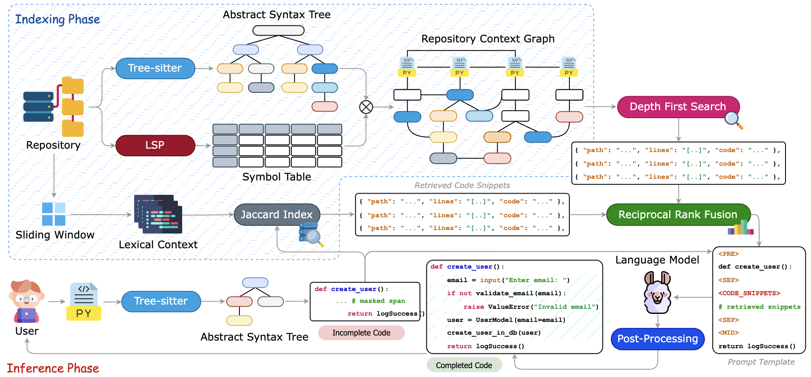
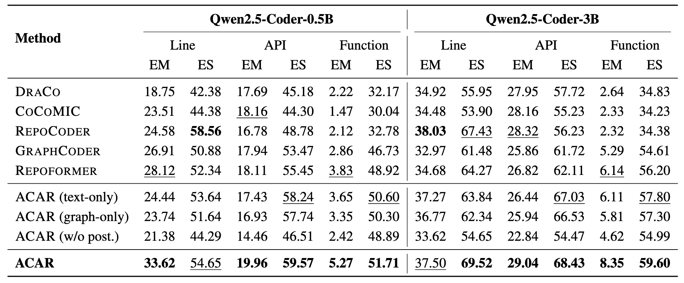
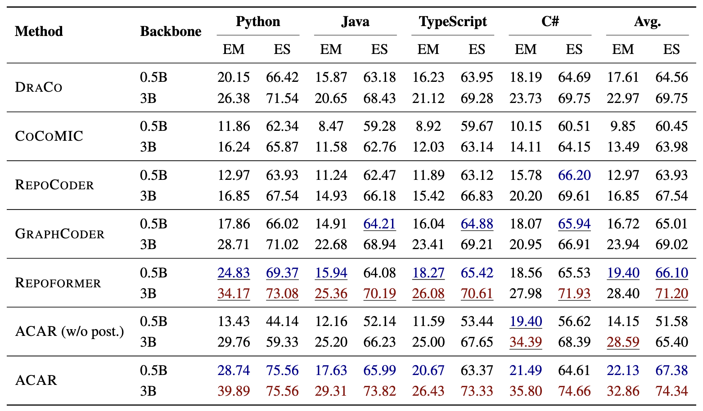

# ACAR: Adaptive Context-Aware Retrieval for Repository-Level Code Completion

[](#installation)
[](#)
[](#license)

ACAR is a repository-level Fill-in-the-Middle (FIM) framework for code completion. It addresses a core limitation of existing approaches: most completion pipelines are file-centric, yet in real repositories the evidence needed to produce a correct completion is often distributed across multiple files and connected through structural dependencies. ACAR closes this gap by combining lexical retrieval, AST- and LSP-derived structural retrieval, line-level reciprocal-rank fusion, and syntax-aware post-processing into a single coherent pipeline that improves completion quality under multi-file context.

In practice, this repository gives you an end-to-end workflow: build retrieval-augmented FIM prompts, run model inference, then refine completions into structurally consistent insertions. The design is intentionally prompt-efficient and usable for both research and benchmarking.

---

## Why ACAR?

If you have ever seen a completion look "locally plausible" but fail because the right definition lives in another file, that is the gap ACAR is built to address. Relevant evidence is rarely confined to a single file—it is distributed across modules, connected by imports, symbol references, and cross-file dependencies.

ACAR is designed around the observation that "good context" is rarely one thing. Sometimes the strongest signal is lexical overlap with a nearby code pattern; other times it is structural connectivity—definitions, references, and symbol neighborhoods that may be lexically distant. In practice, you want both: combined, ranked, and formatted into prompts that a FIM model can reliably consume.

To achieve this, ACAR combines four complementary signals into a single lightweight pipeline:

- **Lexical retrieval** for high-overlap local patterns and recurring implementation motifs.
- **Structural retrieval** from AST and LSP relations for cross-file, symbol-linked evidence.
- **Line-level fusion (RRF)** to unify lexical and structural candidates into a shared ranking space.
- **Syntax-aware refinement** to reduce malformed or misaligned insertions after generation.

---

## Core Features

ACAR is organized as small, composable modules—retrieval, fusion, prompt building, and post-processing—with scripted entrypoints for common workflows. If you only need one piece (for example, graph retrieval or truncation), you can use the modules directly without running the full pipeline.

### Hybrid Retrieval

The retriever is intentionally hybrid, with one branch capturing near-duplicate patterns and the other following symbol structure across files. This design ensures that neither purely lexical nor purely structural signals dominate the final context.

- Sliding-window text retrieval using Jaccard similarity over token sets.
- Graph-based retrieval from symbol, definition, and reference context via Tree-sitter AST and LSP.
- Unified ranking across both sources via Reciprocal Rank Fusion (RRF).

### FIM Prompt Construction

Once context is retrieved and ranked, ACAR serializes it into a format that FIM-capable backbones can consume reliably. The prompt design is model-agnostic, with thin adapters for backbone-specific templates.

- Converts fused snippets into model-ready infilling prompts in ranked order.
- Keeps retrieval context budget-aware, prepending evidence before the local prefix–middle–suffix target.

### Structural Post-Processing

Generation alone is insufficient for structural correctness. ACAR adds an AST-guided cleanup step so the inserted code remains aligned with the surrounding prefix and suffix—one of the most impactful components in the pipeline.

- AST-guided parse-and-truncate using line-aligned ancestor selection.
- Overlap-aware insertion cleanup against the existing suffix and prefix.
- Bracket repair before truncation to handle common delimiter issues.

### Research-Friendly Workflow

For day-to-day use, the repository ships thin CLI wrappers that call into the pipeline implementations, with environment-variable support for reproducible runs.

- Scripted entrypoints for prompt building and post-processing.
- Environment-variable support for reproducible pipeline execution.

---

## Method Overview

ACAR follows a compact repository-level FIM pipeline that is both **prompt-efficient** and **structurally faithful**. The framework is divided into an indexing phase (performed once per repository snapshot) and an inference phase (performed per completion query). The figure below presents the overall ACAR framework.



The four stages below are the mental model to keep in mind when reading the codebase.
**1. Repository pre-processing**

The repository is indexed into two complementary retrieval spaces. A lexical corpus is built by sliding-window segmentation of repository files into reusable context chunks. A structural graph is built using Tree-sitter for hierarchical AST extraction and LSP for lightweight symbol resolution, linking definitions, references, and cross-file dependencies.

**2. Context retrieval + line-level fusion**

At inference time, ACAR queries both retrieval spaces independently. The lexical branch ranks candidate windows by Jaccard similarity against the tail of the current prefix. The structural branch performs a bounded depth-first search from the anchor AST node covering the insertion line, recovering symbol-linked neighbors even when lexical overlap is weak. Both sets of candidates are then normalized into line identities of the form `file_path:line_no` and combined via Reciprocal Rank Fusion (RRF), which allows evidence supported by both branches to accumulate weight on the same line.

**3. Prompt construction + generation**

The fused and ranked snippets are serialized under a token budget and inserted into a backbone-specific FIM template (prefix / middle / suffix). The resulting prompt is passed to the language model to produce an initial completion.

**4. Syntax-aware post-processing**

The initial completion may be redundant or structurally misaligned with the surrounding code. ACAR applies AST-guided truncation: starting from the insertion node, the algorithm traverses upward in the user-side AST to identify the highest ancestor whose span remains aligned with the insertion line, repairs missing closing brackets, and trims overlaps against the existing prefix and suffix. The result is a completion that is syntactically consistent with its context.

---

## Repository Structure

The codebase is split into reusable modules and workflow glue. In general, `pipelines/` contains end-to-end logic while `scripts/` provides stable CLI entrypoints that delegate to those pipelines.

```text
.
├── context_mixer.py               # Main retrieval orchestrator
├── text_retrieval/                # Lexical retrieval modules
├── graph_retrieval/               # LSP/graph retrieval modules
├── ranking/                       # Reciprocal rank fusion
├── post_processing/               # Parse/truncate/refinement logic
├── pipelines/                     # End-to-end data/prompt/postprocess workflows
├── scripts/                       # User-facing CLI entrypoints
├── inference/                     # Model inference scripts
├── schema/                        # Shared typed data structures
├── programming_language/          # Language-specific config helpers
└── requirements.txt
```

---

## Installation

The project is pure Python. A virtual environment is recommended to keep dependencies isolated.

```bash
git clone https://anonymous.4open.science/r/ACAR
cd ACAR

python -m venv .venv
source .venv/bin/activate

pip install -r requirements.txt
```

---

## Dataset Setup

All benchmark datasets can be bootstrapped with a single command:

```bash
bash scripts/download_datasets.sh
```

This script downloads and extracts data into:

- `datasets/RepoEval`
- `datasets/ReccEval` (includes `Source_Code/` and `metadata.jsonl`)
- `datasets/CrossCodeEval`

Downloaded archive files are removed automatically after successful extraction.

---

## Troubleshooting

The most common issues arise when using the structural and LSP retrieval components, which require additional tooling beyond Python packages. In practice, failures usually come down to one of two questions: can the environment resolve symbols for the target repository, and can the parser handle the file's language?

- **LSP retrieval returns empty context:** ensure the relevant language server is available and the repository you are querying is accessible on disk.
- **Tree-sitter parsing issues:** confirm Tree-sitter dependencies are installed from `requirements.txt` and that language IDs match supported values.

If you only need lexical retrieval and post-processing, the pipeline can still run without any LSP dependency.

---

## Command-Line Interface

ACAR exposes lightweight CLI modules under `scripts/`. These are the intended interface for running the pipeline end-to-end. Each module is safe to call with `--help` (eager heavy imports are avoided), and all real work is delegated to the implementations under `pipelines/`.

```text
python -m scripts.build_prompts      --base_dir ... --input ... --output ...
python -m scripts.post_process_jsonl --base_dir ... --input ... --output ...
python -m scripts.post_process_safim [--input ...] [--output ...]
```

Use `--help` on each command for the full list of options.

---

## Quickstart

At a high level, the workflow is: (1) build prompts with retrieval context, (2) run a FIM model to generate completions, (3) post-process to improve syntactic validity and insertion alignment, and (4) optionally apply the SAFIM-specific post-processing step if you are working with SAFIM-format outputs. The examples below mirror that flow.

### 1) Build prompts with retrieval context

This step reads the dataset JSONL, retrieves repository context for each example, and writes a prompt JSONL ready for inference.

```bash
python -m scripts.build_prompts \
  --base_dir datasets/ReccEval/Source_Code \
  --input datasets/ReccEval/metadata.jsonl \
  --output result/prompts.jsonl
```

### 2) Run inference

Inference consumes the prompt file and writes model generations to a new JSONL.

```bash
export ACAR_QWEN_INPUT=result/prompts.jsonl
python inference/qwen_inference.py
```

### 3) Post-process completions

Post-processing re-parses model outputs and applies syntax-aware truncation and cleanup. This step has the largest individual impact on final quality and should not be skipped.

```bash
python -m scripts.post_process_jsonl \
  --base_dir datasets/ReccEval/Source_Code \
  --input result/prompts_Qwen2.5-Coder-0.5B.jsonl \
  --output result/prompts_Qwen2.5-Coder-0.5B_post.jsonl
```

### 4) SAFIM post-processing pipeline

If you are running SAFIM-format outputs, this step applies the SAFIM-specific refinement routine on top of the standard post-processing.

```bash
python -m scripts.post_process_safim \
  --input result/qwen-safim-infillng.jsonl \
  --output result/qwen-safim-infillng-post_processed.jsonl
```

---

## Outputs

Running the pipeline produces a small set of JSONL artifacts that are straightforward to track and diff. Output naming is mostly convention-based: inference derives filenames from the input prompt file, and post-processing appends a suffix (e.g., `_post`).

- Prompt file (from `scripts.build_prompts`): e.g., `result/prompts.jsonl`
- Model generations (from `inference/qwen_inference.py`): derived from the input, e.g., `result/prompts_Qwen2.5-Coder-0.5B.jsonl`
- Post-processed generations (from `scripts.post_process_jsonl`): e.g., `result/prompts_Qwen2.5-Coder-0.5B_post.jsonl`
- SAFIM post-processed output (from `scripts.post_process_safim`): e.g., `result/qwen-safim-infillng-post_processed.jsonl`

---

## Input Data Expectations

ACAR expects JSONL records that contain enough information to (i) define the FIM target (prefix and suffix) and (ii) locate the insertion point within the repository (metadata fields). The fields below are the minimal set used by the provided pipeline scripts.

**Prompt building input (`scripts.build_prompts`)**

JSONL records should include:

- `prefix`
- `suffix`
- `metadata.fpath_tuple`
- `metadata.line_no`
- `metadata.context_start_characterno`

**General post-processing input (`scripts.post_process_jsonl`)**

JSONL records should include:

- `prefix`
- `suffix`
- `metadata.*` (same indexing fields as above)
- `choices[0].text`

---

## Core API Example

The example below shows how to invoke the retrieval pipeline directly through the `ContextMixer` API, without going through the CLI scripts.

```python
import asyncio

from context_mixer import ContextMixer
from schema.common import Document, Position


async def demo() -> None:
    mixer = ContextMixer()
    document = Document(
        uri="test/test.py",
        language_id="python",
        text="def f():\n    pass\n",
        prefix="def f():\n    ",
        suffix="pass\n",
    )
    pos = Position(line=1, character=4)
    result = await mixer.get_context(document, pos, repo="test")
    print("retrieved:", len(result["context"]))


asyncio.run(demo())
```

---

## Environment Variables

Environment variables are optional but convenient for scripting and reproducible runs. All pipeline scripts fall back to sensible defaults when these are not set.

- `ACAR_BASE_DIR`: default retrieval base directory (default: `datasets/ReccEval/Source_Code`).
- `ACAR_QWEN_INPUT`: input JSONL path for `inference/qwen_inference.py`.
- `ACAR_SAFIM_INPUT`: SAFIM input JSONL path.
- `ACAR_SAFIM_OUTPUT`: SAFIM post-processed output JSONL path.

---

## Results

ACAR is evaluated on three repository-level benchmarks—RepoEval [1], ReccEval [2], and CrossCodeEval [3]—across Python, Java, TypeScript, and C#, covering more than 3,000 real-world repositories. Across two Qwen2.5-Coder backbones (0.5B and 3B), ACAR delivers the strongest overall performance on most Exact Match (EM) and Edit Similarity (ES) metrics against five strong repository-level baselines. The numbers below are intended as a quick reference; for careful comparisons, keep backbone, decoding settings, and dataset version fixed.

**Key findings:**

- Hybrid retrieval improves both EM and ES in most benchmark settings over all compared baselines.
- Syntax-aware post-processing is the single most impactful component: removing it causes the largest quality drops across all benchmarks and both backbones.
- Prompt construction remains under 100 ms across all three benchmarks, supporting interactive development workflows.

### Highlights by Research Question

- **RQ1 (Performance):** ACAR leads on most metrics across RepoEval, ReccEval, and CrossCodeEval, with especially clear gains at API and function levels where structural dependencies are most prominent.
- **RQ2 (Practicality):** Prompt construction stays under 100 ms, roughly 3.5× faster than lighter baselines such as DRACO and REPOCODER, and orders of magnitude faster than heavier pipelines like COCOMIC (4,743 ms on ReccEval). Performance remains stable across backbone scales from Qwen2.5-Coder-0.5B to DeepSeek-Coder-6.7B.
- **RQ3 (Multilingual generalization):** ACAR maintains strong performance across Python, Java, TypeScript, and C#, indicating that the hybrid lexical-structural retrieval strategy transfers well across language families and structural conventions.
- **RQ4 (Component contribution):** Ablations confirm that lexical retrieval, structural retrieval, and post-processing are complementary rather than interchangeable. Removing post-processing causes the largest individual quality drop—for example, from 72.46 to 54.28 ES on ReccEval under Qwen2.5-Coder-3B.

Representative scores include **42.98 EM / 72.46 ES** on ReccEval (Qwen2.5-Coder-3B) and **32.86 EM / 74.34 ES** on CrossCodeEval (Qwen2.5-Coder-3B), in each case with clear margins over the best-performing baseline under the same evaluation setup.

The table below summarizes RepoEval results across baselines—including DraCo [2], CoCoMIC [4], RepoCoder [1], GraphCoder [5], and Repoformer [6]—under Qwen2.5-Coder backbones.



The next table reports CrossCodeEval performance broken down by programming language, showing ACAR against the same family of baselines.



---

## Reproducibility Notes

To keep runs comparable across machines and over time, it is helpful to record a compact set of configuration details alongside each set of outputs.

- Keep dataset paths explicit in command scripts rather than relying on environment-variable defaults.
- Record model checkpoint names and decoding seeds per run.
- Ensure language-server setup is consistent across machines when evaluating graph retrieval, as symbol resolution can vary across environments.

---

## Citation

If you use ACAR in your research, please cite the paper below. If you extend the pipeline or use it as a baseline, citing it in accompanying write-ups helps others trace methodology and experimental settings.

```bibtex
@inproceedings{acar2026,
  title={Fast and Focused: Interactive Repository-Level Fill-in-the-Middle Code Completion with Hybrid Structural Retrieval},
  author={Anonymous},
  year={2026},
  booktitle={ARR Submission}
}
```

---

## Ethics Statement

This project is intended for research and evaluation of repository-level code completion. A few considerations are worth keeping in mind when deploying or extending it.

- **Data and licensing:** benchmark datasets are distributed under their own terms; users are responsible for complying with the licenses and policies of any repositories or datasets they evaluate on.
- **Model outputs:** generated code may be incorrect, insecure, or non-idiomatic even when it appears syntactically valid. All outputs should be subject to human review, testing, and security validation before being used in real systems.

---

## License

This repository is intended for research use under the MIT License.

---

## References

[1] Fengji Zhang, Bei Chen, Yue Zhang, Jacky Keung, Jin Liu, Daoguang Zan, Yi Mao, Jian-Guang Lou, Weizhu Chen. *RepoCoder: Repository-Level Code Completion Through Iterative Retrieval and Generation*. EMNLP, 2023.

[2] Wei Cheng, Yuhan Wu, Wei Hu. *Dataflow-Guided Retrieval Augmentation for Repository-Level Code Completion*. ACL, 2024.

[3] Yangruibo Ding, Zijian Wang, Wasi Uddin Ahmad, Hantian Ding, Ming Tan, Nihal Jain, Murali Krishna Ramanathan, Ramesh Nallapati, Parminder Bhatia, Dan Roth, Bing Xiang. *CrossCodeEval: A Diverse and Multilingual Benchmark for Cross-File Code Completion*. NeurIPS Datasets and Benchmarks Track, 2023.

[4] Yangruibo Ding, Zijian Wang, Wasi Ahmad, Murali Krishna Ramanathan, Ramesh Nallapati, Parminder Bhatia, Dan Roth, and Bing Xiang. *CoCoMIC: Code Completion by Jointly Modeling In-file and Cross-file Context*. LREC-COLING, 2024.

[5] Wei Liu, Ailun Yu, Daoguang Zan, Bo Shen, Wei Zhang, Haiyan Zhao, Zhi Jin, and Qianxiang Wang. *GraphCoder: Enhancing Repository-Level Code Completion via Coarse-to-fine Retrieval Based on Code Context Graph*. ASE, 2024.

[6] Di Wu, Wasi Uddin Ahmad, Dejiao Zhang, Murali Krishna Ramanathan, and Xiaofei Ma. *Repoformer: Selective Retrieval for Repository-Level Code Completion*. ICML, 2024.
